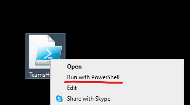

# TeamsHealer
## Step 1
Run `TeamsHealer.ps1` script in powershell

## Step 2
Wait for cleanup and downloading latest Teams version

## Step 3
Teams will restart automatically. If auto-sign-in failed:

Click `signing out` link and follow login prosedure using Authenticator App.

## ...

## PROFIT 